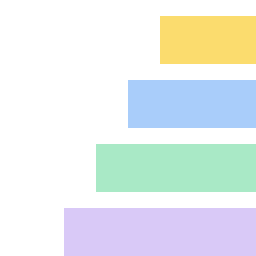

# Have you note-this?



A deck of sticky notes docked to the right edge of every screen, as an
[Omarchy](https://omarchy.org) shell plugin. It is a Linux/Hyprland clone of
the macOS app [holdmynotes.app](https://holdmynotes.app/), built on Quickshell
layer surfaces instead of AppKit panels.

Three states, one movement:

| State | What you see |
|-------|--------------|
| At rest | A thin pill on the screen edge, one coloured dash per note. |
| Reached | The notes shingle down the edge, 45ms apart, each showing its label. |
| Opened | One note slides clear of the deck at full size, ready to type in. |

Typing writes itself to disk 250ms after you stop. Note bodies and titles are
encrypted before they are written, and the key lives in your login keyring.

## Requirements

Omarchy 4 (the plugin runs inside `omarchy-shell`), and nothing that is not
already on an Arch box: `python3`, `setpriv`, `mkdir`, `xdg-open`. `secret-tool`
(libsecret) is used for the encryption key and is optional — without a keyring
the key falls back to a 0600 file, and the About card says which one is holding
it. `imagemagick` is only needed to redraw the logo.

## Install

```bash
omarchy plugin add https://github.com/andresblancomorales/have-you-note-this.git
omarchy plugin enable ablanco.notethis --after omarchy.tray
~/.config/omarchy/plugins/ablanco.notethis/bin/notethis-setup
```

`omarchy plugin add` clones into `~/.config/omarchy/plugins/ablanco.notethis`
— the directory is named by the manifest id — and leaves the plugin disabled so
you can read the code before running it. Cloning it there by hand works just as
well; `omarchy-shell shell rescanPlugins` picks it up.

The plugin is both a panel (the deck) and a bar widget (the button), so
enabling it once puts the button on the bar and the deck on every screen edge.
The placement is any `omarchy bar` placement — `--section right`,
`--before omarchy.clock`, and so on. If the plugin was already enabled as a
panel before the widget existed, `omarchy plugin disable` then `enable` again
moves its entry from `plugins[]` into the bar layout.

`notethis-setup` adds the keybindings and the All Notes window rule to
`~/.config/hypr/bindings.lua` and `~/.config/hypr/hyprland.lua` inside a
`-- BEGIN ablanco.notethis` block, backing up each file first.
`notethis-setup --remove` takes the block back out.

To disable the plugin: `omarchy plugin disable ablanco.notethis`.

## Keys

| Key | Does |
|-----|------|
| `SUPER + ALT + N` | New note |
| `SUPER + ALT + A` | All Notes |
| `SUPER + ALT + L` | Archive |
| `SUPER + ALT + D` | Fold the deck open, with the keyboard in it |

A deck opened that way takes the keyboard: `↑ ↓` walk the notes and scroll the
deck to follow, `Home`/`End` jump to the ends, `Return` opens the one under the
cursor, `Ctrl + N` writes a new one, and `Esc` folds it away. Reaching for the
deck with the pointer never takes the keyboard — a deck that grabbed it every
time the pointer brushed the screen edge would be unusable — so this is the one
way in.

`Esc` steps back one at a time: out of an open note to the deck, then out of
the deck.

Inside an open note. An open note takes the keyboard — the same contract as
the shell's clipboard and emoji overlays — so `Esc` is the way back out, and
the card says so while the caret is in it:

| Key | Does |
|-----|------|
| `Esc` | Close the note (or the find bar) |
| `Ctrl + F` | Find in note; `Enter` walks the matches, wrapping |
| `Ctrl + .` | Cycle its colour |
| `Ctrl + P` | Keep it on top, or take it back |
| `Ctrl + Shift + A` | Archive it |
| `Ctrl + Backspace` | Delete it — press twice, then ten seconds to undo |

The bar button and `SUPER + ALT + A` **toggle** the window. Quickshell's
windows ignore the compositor's close request, so `SUPER + W` does nothing to
this one — `Esc`, the bar button and that shortcut are the ways out.

`F1` or `?` in the All Notes window shows every one of these on one card —
also under the ⋯ menu, in the pill's right-click menu, and at
`omarchy-shell notethis shortcuts` if you would rather bind a key to it.

**About** sits beside it in both menus: version, repository, plugin id, where
the database is and which key store is holding the key. Every one of those is
read from the manifest and the running store rather than typed into the card,
so it cannot drift from the truth.

Right-click the pill or any tab for the same actions plus **Show over
full-screen apps**, which moves the deck from Hyprland's `top` layer to
`overlay` so a full-screen window no longer covers it.

## Checklists

A note is a list most of the time, so `- [ ]` and `- [x]` are understood in the
body. Click the box to tick it, or `Ctrl + Return` ticks the one the caret is
on. They are stored as the markdown they look like, so an exported note is
still a checklist wherever it lands.

What that buys is the count: a deck tab carries a thin progress bar along its
edge and the All Notes row reads `3/7`, so a deck of half-done lists says so
without being opened.

## Notes kept on top

An open note has a pin in its button row and answers `Ctrl + P`; the same key
takes it back. Right-click a tab and **Keep on top** does the same. The note
leaves the deck and floats above your windows, where you drag it wherever you
want it. It edits in place like any other note, and the button in its corner
puts it back in the deck.

The wallpaper would be the prettier metaphor — a sticky note belongs on the
desk, not on the work — and that is where this started, on the bottom layer.
It was wrong: on a tiling window manager the desktop is covered nearly all of
the time, so a note stuck to it is a note you never see. It sits on the top
layer now, and still under fullscreen windows, so a video or a game gets the
screen to itself.

Drag it by the grip at its top, or by the margin around the writing. Not by
the writing itself: inside a note a press is a caret, and the text field takes
it first — which is why the note would not move at all until the grip existed.

A pinned note leaves the deck while it is up; being in both places at once
would just be the same note twice. Its window is keyed by the note's id rather
than by the note itself — a note object is replaced on every write, twice per
save, and a window keyed to that object was torn down and rebuilt each time,
which is how typing in a pinned note made it blink and drop the caret. Pinning also folds the deck away — the note
went to the top of the screen, and a deck left fanned open behind it is state
nobody asked to keep.

Unpinning says so without opening anything: the note names itself beside its
dash on the resting pill for a couple of seconds, and the pill scrolls to it if
it landed out of sight. The deck fans out when the pointer reaches for it, and
a note coming back is not the pointer asking for anything.

The dash nudging on its own was the first attempt, and it was invisible in
practice — seven pixels for a fifth of a second, at the edge of the screen,
while the eye is on the middle of it where the note just vanished from. Its position is remembered per screen, and
a note whose screen is gone comes back on the first one rather than nowhere.

## The bar button

The bar carries a note glyph and the number of notes in the deck. Left click
opens All Notes, right click writes a new note, middle click folds the deck
open. The button lights up while the browser window is open.

It is a bar widget rather than a system-tray icon on purpose: Quickshell
*consumes* the tray (that is what `omarchy.tray` shows) but does not publish
into it, so a real StatusNotifierItem would mean a second process running
beside the shell for the sake of one icon.

Take it off the bar with `omarchy bar move`, or turn the count off:

```bash
omarchy bar set ablanco.notethis showCount false
omarchy bar set ablanco.notethis glyph 󰠮
```

## The deck

Hovering any of the note's buttons names it and the key that does the same
thing, so the shortcuts are learnable without opening this file. Only one of
them is destructive and only that one looks it: delete is a red bin, set
apart from the others; archive is a box with an arrow going into it, because
next to a delete button anything bin-shaped reads as "this destroys the
note".

A tab is only as long as the deck lets it be, so its rotated label runs to two
lines before it elides, and hovering shows the whole title in a tooltip — but
only when there is more of it to show. In an open note the title wraps rather
than running off the edge of the card. No marquee: text that moves on its own
at the edge of the screen is the one thing you cannot ignore, and it makes you
wait to read what a tooltip says at once.

Hovering a tab pulls it a little out of the deck — the same movement the
keyboard cursor makes, so pointing and arrowing feel like one gesture rather
than two conventions.

The deck holds as many notes as the screen can fit — fourteen on a 1440px
display, fewer on a laptop panel — and puts the rest behind a `+N` tile you
click or scroll through. Tabs share the height that is there rather than
being a fixed size, so a deck of thirty notes still uses the whole edge.

**Which notes make the edge** is the interesting half of that. The default is
**most recently edited first**: the deck is the working set, and a note you
just wrote should not fall off the edge the moment a fifteenth note exists.
Right-click the pill to choose otherwise:

| Order | Puts on the edge |
|-------|------------------|
| Recently edited | the notes you touched last *(default)* |
| The order I added them | the stored order, oldest additions first |
| Oldest first | first written, first shown — a deck used as a queue |

The choice is saved, so it is the order from then on. Archiving pulls a note
off the edge without losing it: it keeps its colour, its dates and its place
in search, and `SUPER + ALT + L` opens the archive to read one again or put it
back.

Every screen gets its own pill on its right edge. The deck fans out on the
screen the pointer entered and stays there while you use it.

With nothing in the deck the pill holds a single dash in your theme's accent
colour instead of the coloured ones — a dark lozenge on a dark wallpaper is
not an affordance. Reaching for it fans out an accent-outlined **NEW NOTE**
tab, so an empty deck still says what it is and what to do with it.

## All Notes

`SUPER + ALT + A` opens every note in one window: search across titles, bodies
and `#tags`, filter to Active or Archived, tick any number of notes and take
them out.

The note in the reading pane is **editable in place** — same fields, same
250ms autosave as the card on the screen edge, and `Ctrl + F` finds inside it.
Switching to another note flushes what you typed into the one you left, and a
note edited on the screen edge updates here while you watch (and the other way
round) — the two surfaces read the same store, and neither writes stale text
over the other.

Each tab sorts on its own: the control beside the filters offers **recently
edited**, **recently created**, **title A–Z** and **deck order**, and remembers
a separate answer for All, Active and Archived — the archive is a place you
search, the deck is a place you work, and they rarely want the same order.
Deck order is not offered on the archive tab, where it means nothing.

The tick box beside the filters takes the whole list as it stands — a tick
when everything shown is selected, a dash when only some of it is — so
filtering to what you want and then acting on all of it is two clicks rather
than thirty. `Ctrl + A` does the same, and means the notes even while the
search field has a query in it, since filtering first is the reason to want
it; `Esc` still clears the query.

Every button in that window acts on **what is ticked**, or on the note being
read when nothing is — and says how many it is about to touch (`Delete 5`,
`Archive 5`). `Clear` drops the selection, `Ctrl + Z` puts back the last
delete, and ticks disappear along with the notes they pointed at.

**Delete asks twice** — the button turns red and reads *Sure?*, the key wants a
second press, and either forgets it was asked after three seconds or if the
selection moves underneath it. The ten-second undo catches the mistake after
the fact; this catches it before.

Both live behind the **⋯** button in the window's title row — they are the
same operation in two directions, and neither is something anyone does often
enough to hold space in the rows meant for what you do to a note. Choosing one
opens a sheet over the window with the destination selected, ready to type
over or accept with Return.

| Export | Produces |
|--------|----------|
| Markdown | one `.md` per note, in the folder you name |
| Plain text | one `.txt` per note |
| Single file | every selected note in one document |
| Sticky archive | a `.stickies` file that imports back with colours, states and dates intact |

The destination is a path you type: a folder for the per-note formats, a file
name for the other two. Import reads a `.stickies` archive back; a note whose
id is already here comes in under a fresh one rather than overwriting.

## Where your notes live

`~/.local/share/notethis/notes.db`, a SQLite database on this machine.
There is no account, no server and no telemetry; nothing in this plugin opens
a socket.

Each note's **title and body are sealed with ChaCha20-Poly1305** before they
are written. Colour, state, position and timestamps stay in the clear so the
deck can sort and draw without the key. The associated data for each field is
`<note id>:<title|body>`, so a stored blob cannot be moved between notes or
between the title and the body and still decrypt.

The 32-byte key is generated on first run and stored in your login keyring via
`secret-tool` (libsecret). On a machine with no keyring to talk to it falls
back to `~/.local/share/notethis/master.key`, mode 0600, and the All Notes
window says which of the two is in use.

The cipher is implemented in `bin/notethis_crypto.py` rather than pulled from a
dependency, because Arch's Python has no AEAD in its standard library,
`openssl enc` refuses AEAD ciphers, and a plugin that fails to load on a
machine without `python-cryptography` is worse than 80 lines of ARX. It is
checked against the RFC 8439 vectors in `tests/test_crypto.py`.

## Layout

| File | What it is |
|------|-----------|
| `NoteThis.qml` | Plugin root: store, shared state, one deck per screen |
| `DeckWindow.qml` | One screen's layer surface: pill, fan, editor placement, menu |
| `BarWidget.qml` | The bar button: note count, opens All Notes |
| `NoteEditor.qml` | The open note's card: tab, rule, actions |
| `NoteFields.qml` | Title, body, find bar, checklists and autosave — shared by every editor |
| `PinnedNote.qml` | A note kept above the windows, on the top layer |
| `AllNotes.qml` | The All Notes browser window |
| `Store.qml` | The helper process, seen from QML |
| `Notes.js` | Palette, search, previews, dates — pure, and unit tested |
| `Strings.js` | Every word the plugin shows, per language |
| `assets/logo.py` | The app mark, as a grid of characters — run it to redraw the PNGs |
| `bin/notethis-store` | SQLite + encryption daemon, line-delimited JSON over stdio |
| `bin/notethis_crypto.py` | ChaCha20-Poly1305 |
| `bin/notethis-setup` | Installs and removes the Hyprland block |

Every tap in the plugin is `ReleaseWithinBounds` rather than Qt's default
`DragThreshold`: these are buttons, and the default cancels a tap that drifts a
couple of pixels between press and release — which is what every tap on a
touchpad does.

The deck's layer surface is a fixed full-height strip whose **input mask** is
just the parts you can actually click: a 16px reach strip when the deck is
resting, the tabs and the open note when it is not. Everything else on that
strip stays click-through, so the desktop underneath keeps working.

## Scripting

```bash
omarchy-shell notethis newNote            # create one and open it
omarchy-shell notethis allNotes           # open the browser
omarchy-shell notethis archive            # open it filtered to Archived
omarchy-shell notethis toggle             # fold the deck open or shut
omarchy-shell notethis list               # id, title, colour, state as JSON
omarchy-shell notethis openNote <id>      # lift one note out of the deck
omarchy-shell notethis count              # notes in the deck
omarchy-shell notethis shortcuts         # open the cheat sheet
omarchy-shell notethis about             # open the About card
omarchy-shell notethis reload            # re-read the database
omarchy-shell notethis state              # what the deck thinks it is doing
```

## Tests

```bash
python3 tests/test_crypto.py     # RFC 8439 vectors, tampering, wrong key
python3 tests/test_store.py      # sealed round-trips, ordering, export, import
node --test tests/test-notes.mjs   # palette, search, previews, dates, deck slicing
node --test tests/test-strings.mjs # every language answers for every key the UI asks for
```

## Language

English and Spanish. `"language": "auto"` follows the session's `LANG`;
`"en"` or `"es"` overrules it, which is what a machine whose locale is one
language and whose owner is another needs. The same three choices are in the
All Notes window's ⋯ menu and in the pill's right-click menu.

Omarchy has no language setting to inherit from — there is no `qsTr()` and no
`.qm` file anywhere in the shell — so this plugin carries its own. Not Qt's
machinery either: Quickshell gives QML no way to install a `QTranslator`, so
`qsTr()` would compile and then do nothing. `Strings.js` holds one table per
language and `t()` reads it, which also means the tables can be checked in
node: `tests/test-strings.mjs` fails if a language is missing a key, leaves one
blank, or drops a `{placeholder}` the English text has.

Adding a language is a table in `Strings.js`, its month names, and its entry in
`LANGUAGES` — no other file changes.

## Settings

`~/.config/notethis/settings.json`:

```json
{
  "overFullscreen": false,
  "deckLimit": 0,
  "deckOrder": "recent",
  "listSort": { "all": "updated", "active": "updated", "archived": "updated" },
  "language": "auto"
}
```

Every one of these is also in the pill's right-click menu, which is where they
are meant to be changed; the file is where they land.

`deckLimit: 0` means "as many tabs as this screen fits", which is the default.
A number pins it instead — `8` reproduces the Mac app's fixed deck. `deckOrder`
is `recent`, `manual` or `oldest`; each `listSort` tab is `updated`, `created`,
`title` or `deck`.

## Differences from the Mac app

- Shortcuts use `SUPER + ALT` where the original uses `⌥⌘`, and `Ctrl` where it
  uses `⌘`.
- Encryption is ChaCha20-Poly1305 with the key in libsecret, rather than
  AES-GCM with the key in the macOS keychain.
- There is no licence check, so nothing here ever makes a network call.
- Everything is set in your Omarchy theme font at `Style.font` sizes, and the
  All Notes window takes its background, text, accent and urgent colours from
  the theme too. The original writes note bodies in a handwriting face on
  cream paper; on a themed desktop a second typeface and a second palette read
  as a foreign app rather than as part of the system. The notes themselves
  keep their paper colours — that is the note, not the chrome.

## Licence

MIT.
